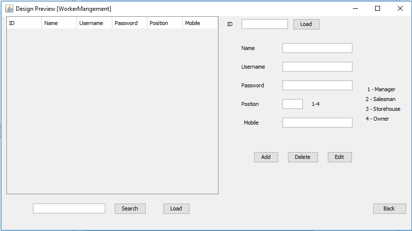

# Super-Shop-Management
## Introduction   
Supermarket are a very busy place for nowadays. That’s why so
many supermarket can’t control their customers efficiently and manage
their shop. To get rid of from these problem we created a software
known as software management. I wish it will help supermarket
owner to overcome with management problem and increase their
profit by controlling more customer in less time.

## Features
This software is divided into four (4) Worker groups where each
can do their part. Everything is connected to a single database 
this everyone can access the updated information at any time. As the
work is divided thus workers can save more time while using the
software. By using this software we can control customer’s buys in
manual and digital format. We can add items category-wise and with
items code wise. We can calculate total sales in anytime range
and store customer information in the database. We can add, remove and edit items in the storehouse and more.
 Divided into workers.   
* Easily access to the database.
* Easily manage workers and items.
* Easily track customer and total sales.

## Database Tables

   

## Working procedure
At startup, we have to select the desired profession and need to login With the given password by the owner or manager.

## Manager
The manager is the head of management in any organization. They control everything related to the job. By hiring workers, ordering items, keeping records of sales and more.

   

## Owner
The owner is who won the shop. He has the master password and
username and has the admin power of the software. He can do almost everything.

 

## Worker Management

Owner can add, delete and edit worker information.

 

## Salesman
Here salesman is the worker who sells items to the customer and keeps the selling record and money. With this software, the salesman can sell goods by manually selecting an item from all items to add to a report or they can
use product name/ID as a reference to add to the report.
The salesman also needs a username and password from the owner/manager.

   

## PDF Sales Report

   

## Storehouse

 

## Add Items to storehouse

 

